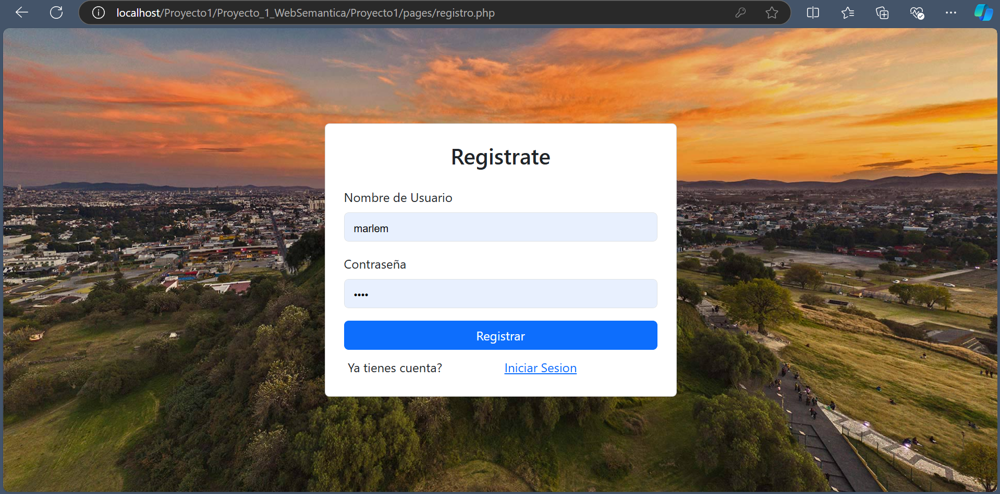
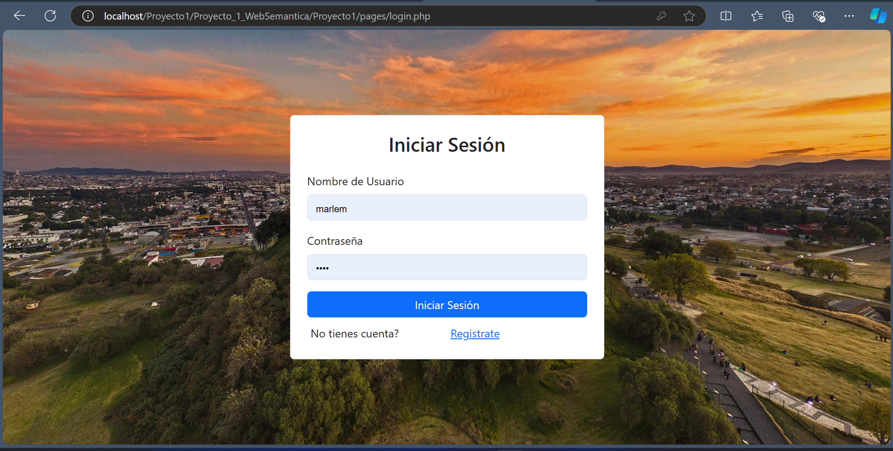
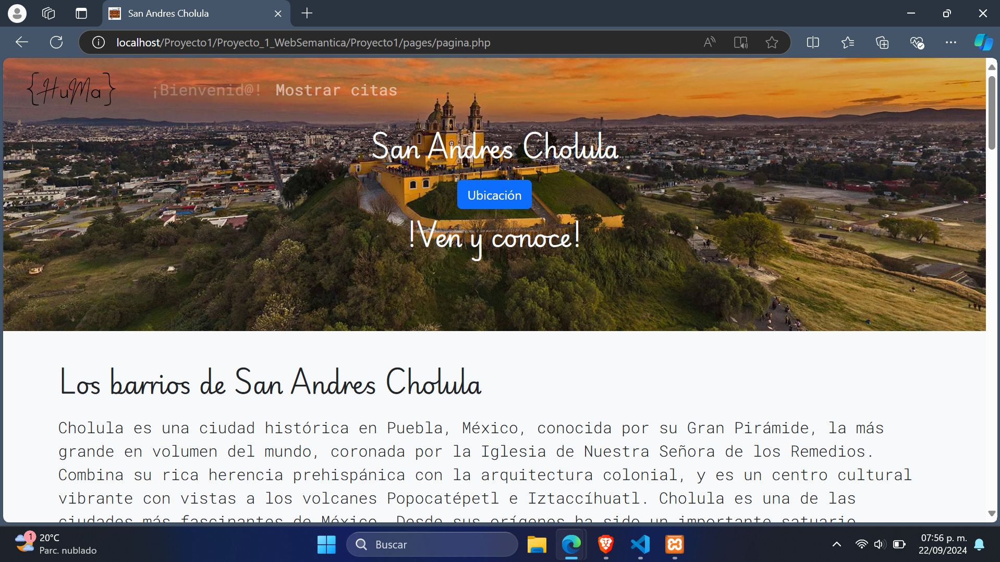
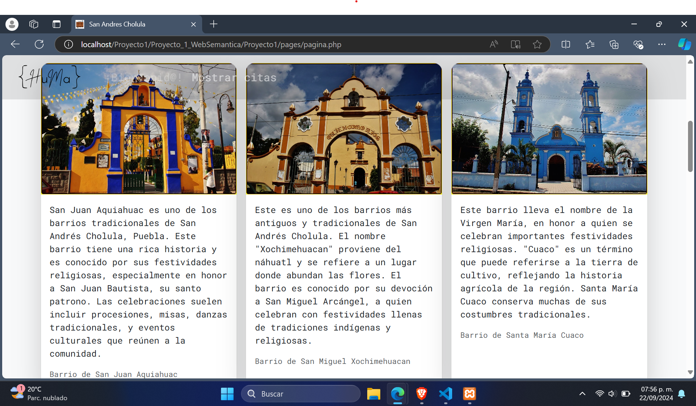
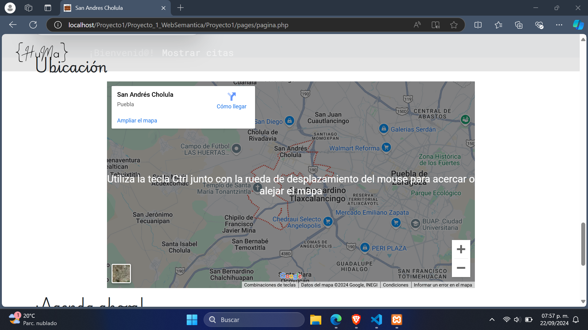
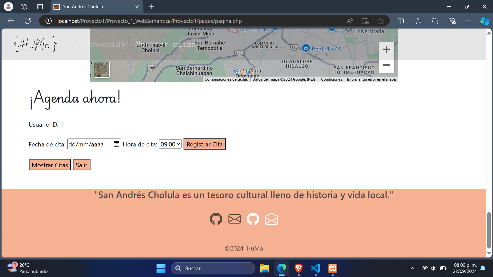
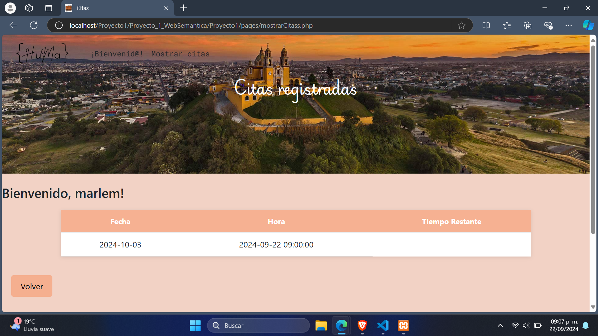

# Explora Cholula a tu Ritmo

El presente proyecto es Página web diseñada para facilitar la reserva y gestión de citas para visitar los principales barrios. Ofrece a los usuarios la posibilidad de programar sus visitas de manera eficiente, garantizando una
experiencia personalizada y organizada. Fue desarrollado con HTML, CSS y PHP con el uso de el framework de UI, Bootstrap utilizando además XAMPP.

La página es responsiva (adaptable a diferentes tamaños de pantalla) 

## Secciones de mi sitio

## Tecnologías
* HTML
* CSS
* Bootstrap
* PHP
  

---
Desarrollado con 🩷 por [Marlem](https://portafolio-umber-alpha.vercel.app/) 
